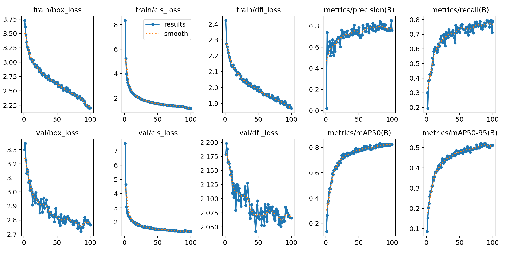
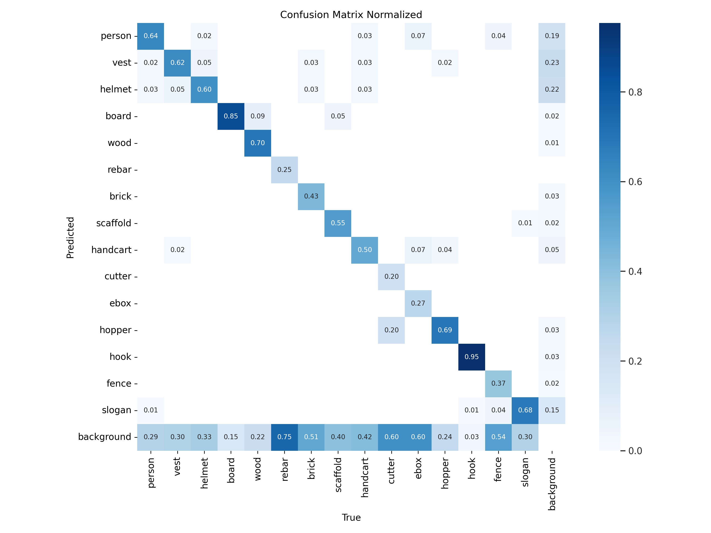
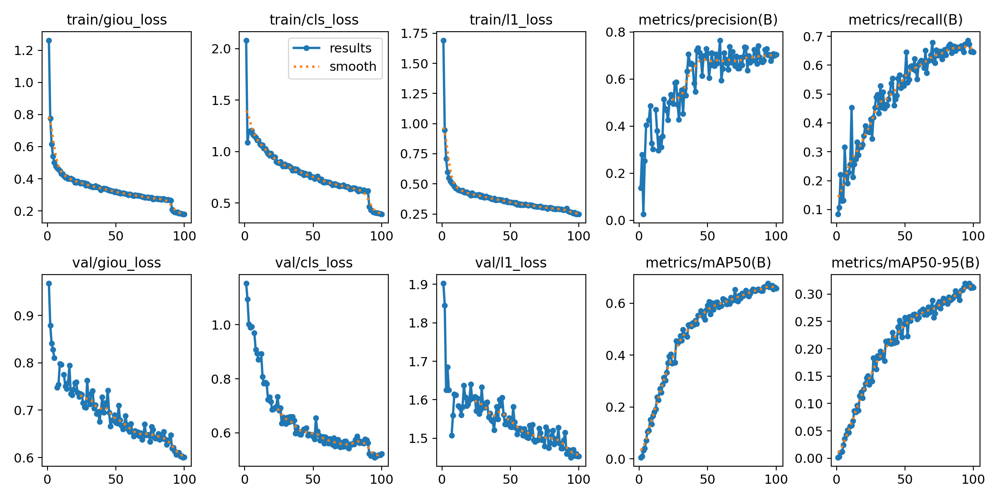
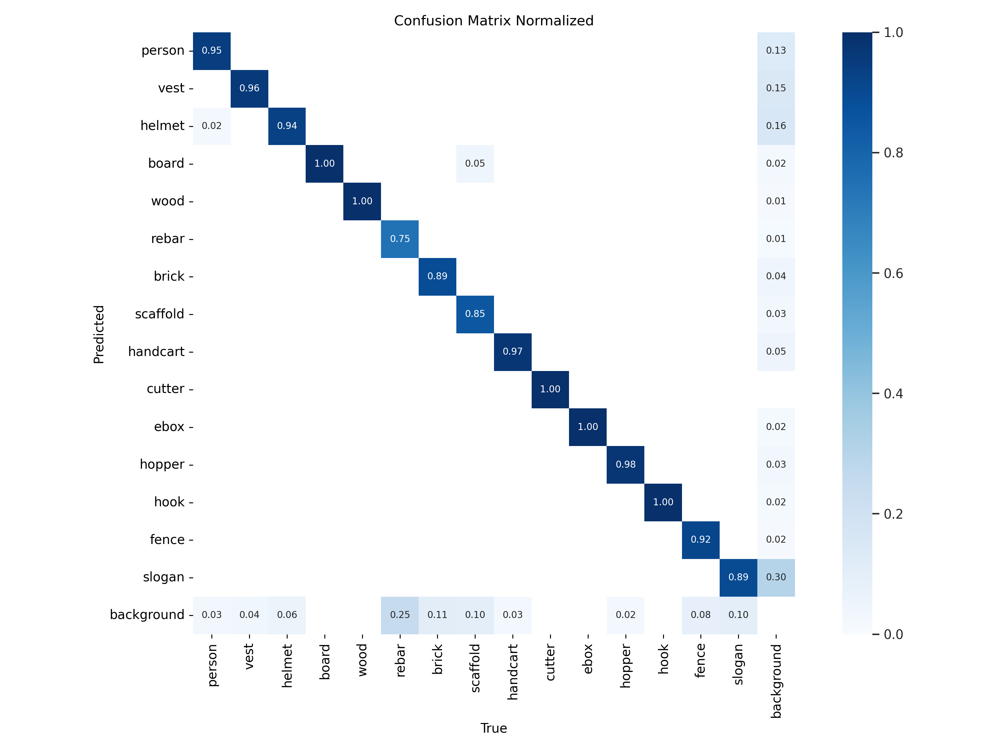

# IS597MLC-Final-Project

The dataset in this repo is a fraction of the original (much bigger) dataset: *SODA: A large-scale open site object detection dataset for deep learning in construction*, from Rui Duan, Hui Deng, Mao Tian, Yichuan Deng, Jiarui Lin. (https://www.sciencedirect.com/science/article/abs/pii/S0926580522003727)

This curated, "bite-sized" dataset for this project contains:
- 1000 images with labels for training
- 100 images with labels for testing

The images are in .jpg format, and the labels have been transformed to .txt, but these were originally in .xml files (the corresponding files are included as well).
The

 

## **YOLOv10**
The best results for this model were achieved with the pretrained version `yolov10n.pt`:

 

For this model, the **normalized confusion matrix**:

 

## **DeTr**
The best results for the DeTr were achieved with the pretrained version `rtdetr-l.pt`:

 

, and this is the **normalized confusion matrix**:

